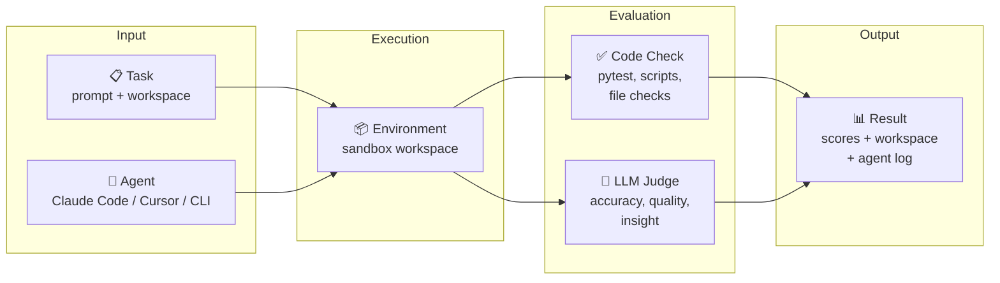
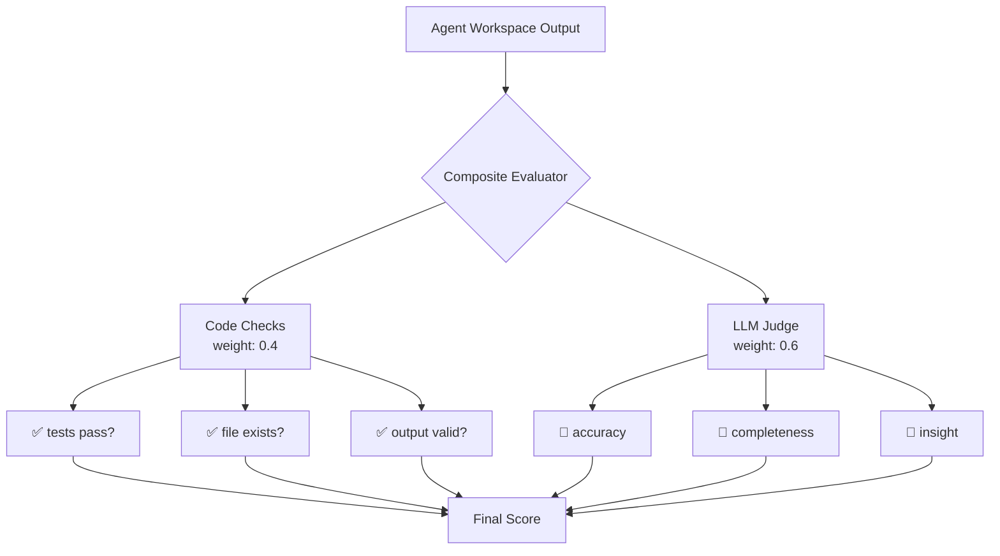
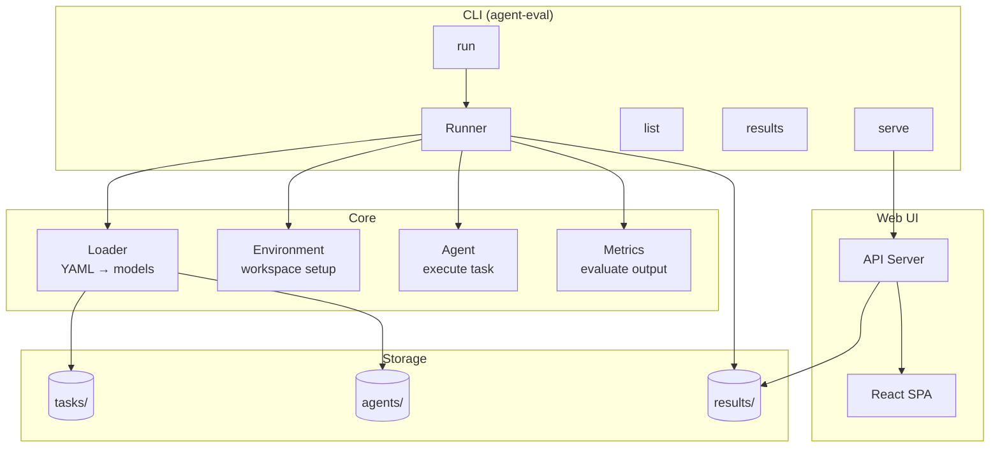

# Auto Agent Eval (AAE)

A pluggable framework for evaluating AI coding agents — **where agents judge agents**.

AAE runs coding tasks against any CLI-based agent (Claude Code, Cursor, etc.), then scores the results using both deterministic checks and LLM-as-judge evaluation. Every run archives the full workspace, agent output, and per-metric scores for human review.

## How It Works



## Core Idea: Agent-as-Judge

Traditional benchmarks use only deterministic checks (tests pass / fail). AAE combines both:



This lets AAE evaluate tasks that have no single "correct answer" — like writing reports, refactoring code, or generating analysis.

## Features

- **Agent-as-Judge** — LLM evaluators score subjective quality (readability, insight, accuracy)
- **Deterministic checks** — pytest, file existence, script output, custom Python scripts
- **Composite scoring** — weighted combination of code checks + LLM judges
- **Full archival** — workspaces, agent logs, and original files preserved for every run
- **Web dashboard** — browse results, drill into metrics, view workspace files in-browser
- **Pluggable** — add tasks and agents via YAML, no code changes needed

## Quick Start

```bash
# Install
uv sync

# List available tasks and agents
uv run agent-eval list

# Run Claude Code on all tasks
uv run agent-eval run --agent claude-code

# Run on a specific task
uv run agent-eval run django-11099 --agent claude-code

# Compare agents
uv run agent-eval run -a claude-code -a claude-code-opus

# Filter by category
uv run agent-eval run --agent claude-code --category bugfix

# View results in terminal
uv run agent-eval results

# Start web dashboard
cd web && npm install && npm run build && cd ..
uv run agent-eval serve --port 9090
```

## Architecture



| Component | Role | Config |
|-----------|------|--------|
| **Task** | What to do | `tasks/{id}/task.yaml` + `workspace/` + `eval.yaml` |
| **Agent** | Who does it | `agents/{id}.yaml` (claude-code, cli, mock, script) |
| **Environment** | Where to run | Local sandbox or Docker |
| **Metric** | How to judge | `code_check` (deterministic) or `llm_judge` (LLM scoring) |

## Results Structure

Every run is fully archived for human review:

```
results/20260318_070812_claude-code/
├── summary.json                        # overall scores, by-agent, by-category
├── csv-stats.json                      # per-task metric details
├── django-11099.json
├── workspaces/
│   └── claude-code/
│       ├── csv-stats/
│       │   ├── .originals/             # files before agent ran
│       │   ├── stats.py               # files after agent ran
│       │   └── test_data.csv
│       └── django-11099/
│           └── validators.py
└── logs/
    └── claude-code/
        ├── csv-stats.log              # raw agent output
        └── django-11099.log
```

## Adding a Task

```
tasks/my-task/
├── task.yaml           # prompt + metadata
├── eval.yaml           # metrics definition
└── workspace/          # initial files given to the agent
```

**task.yaml:**
```yaml
name: my-task
prompt: |
  Fix the bug in main.py. Run `python test.py` to verify.
metadata:
  category: bugfix
  difficulty: easy
```

**eval.yaml:**
```yaml
evaluator:
  type: composite
  evaluators:
    - type: code
      weight: 0.6
      checks:
        - name: "tests pass"
          type: command
          cmd: "python test.py"
          expect_exit: 0
    - type: llm_judge
      weight: 0.4
      rubric:
        quality: "Is the fix clean and minimal?"
```

## Adding an Agent

```yaml
# agents/my-agent.yaml
name: My Agent
type: cli
config:
  command: my-agent-cli
  timeout: 300
```

Supported types: `claude-code`, `cli`, `mock`, `script`

## Included Tasks

| Task | Category | Difficulty | Description |
|------|----------|------------|-------------|
| csv-stats | data | easy | Fix a CSV stats script that crashes on non-numeric data |
| django-11099 | bugfix | easy | Fix URLValidator to accept IPv6 URLs (from SWE-bench) |
| wordfreq | coding | easy | Build a word frequency CLI tool from scratch |
| refactor | refactoring | medium | Refactor messy code while preserving behavior |
| sales-report | analysis | medium | Analyze CSV data and write a Markdown report |

## Tech Stack

- **Backend**: Python 3.14, PyYAML, stdlib HTTP server
- **Frontend**: Vite + React + TypeScript
- **Package manager**: uv

## License

MIT
