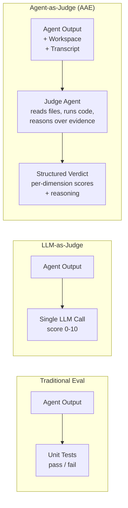
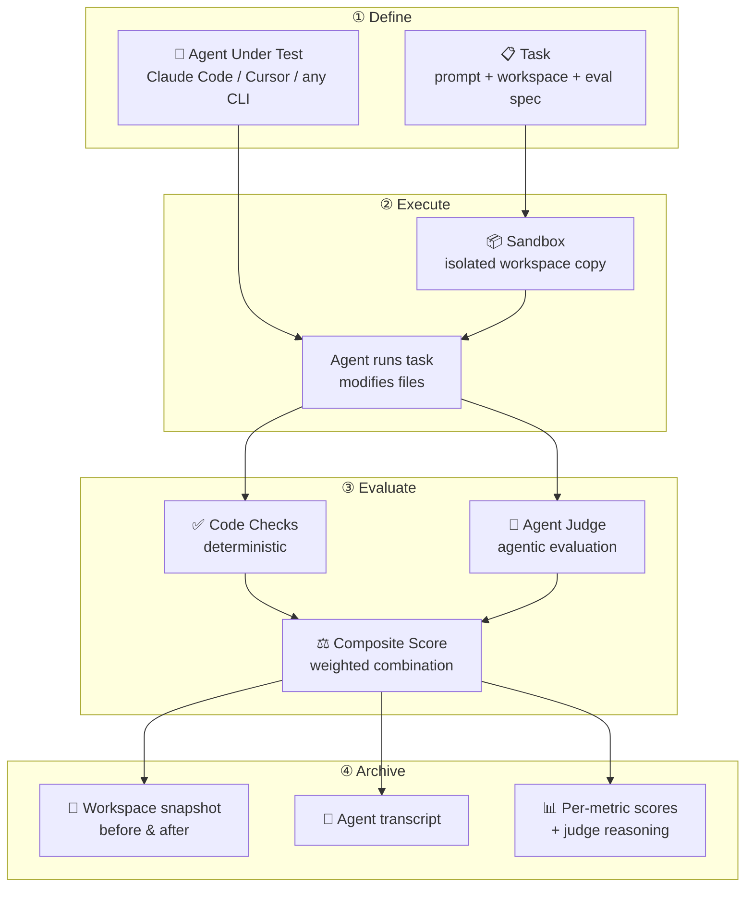
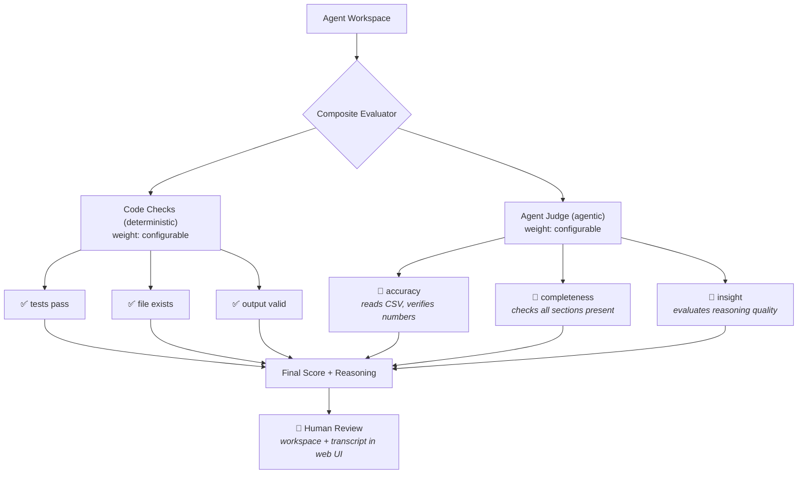
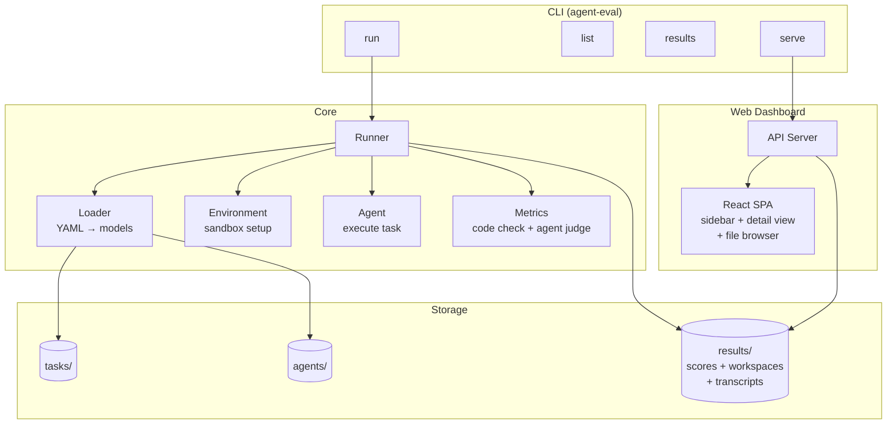

# Auto Agent Eval (AAE)

A pluggable framework for evaluating AI coding agents — **where agents judge agents**.

[中文文档](./README.zh.md)

## Why "Agent-as-Judge"?

Most benchmarks use simple pass/fail tests. But real-world agent tasks — refactoring code, writing reports, analyzing data — have no single "correct answer". AAE goes beyond **LLM-as-Judge** (a single API call scoring text) to **Agent-as-Judge**: a full agent with tools, file access, and code execution capabilities that reviews another agent's work, just like a human reviewer would.



The judge agent doesn't just read the output — it can inspect the workspace, run the code, diff against originals, and reason about quality across multiple dimensions. This mirrors how a senior engineer reviews a pull request: not just "does it compile?" but "is this the right approach?"

## How It Works



Every run archives the complete workspace (before and after), agent output transcript, and detailed per-metric scores with judge reasoning — enabling human review of any result.

## Evaluation Philosophy

Inspired by [Anthropic's eval framework](https://www.anthropic.com/engineering/demystifying-evals-for-ai-agents), AAE is built around these principles:

### Three Layers of Grading

| Layer | What | When to Use |
|-------|------|-------------|
| **Code Check** | pytest, file existence, script output, exit codes | Verifiable outcomes with clear pass/fail |
| **Agent Judge** | An agent that reads files, runs code, and reasons | Subjective quality, design decisions, completeness |
| **Human Review** | Browse workspace + transcript in web UI | Calibration, edge cases, final sign-off |



### Outcome vs Transcript

AAE evaluates both **what the agent produced** (outcome) and **how it got there** (transcript):

- **Outcome**: Did the code pass tests? Does the report contain correct numbers?
- **Transcript**: What did the agent do? How long did it take? What tools did it use?

Both are archived for every run, because a passing score doesn't tell the whole story — you need to read the transcripts.

### Capability vs Regression

- **Capability evals** start at low pass rates — tasks the agent struggles with, giving you a hill to climb
- **Regression evals** should stay near 100% — protecting against backsliding when you change prompts or models

As capability evals reach high pass rates, they graduate into the regression suite.

## Features

- **Agent-as-Judge** — judge agents that read files, run code, and reason over evidence
- **Code checks** — pytest, file existence, script output, custom Python scripts
- **Composite scoring** — weighted combination of code checks + agent judges
- **Full archival** — workspaces (before & after), agent transcripts, judge reasoning
- **Web dashboard** — sidebar navigation, drill into metrics, browse workspace files
- **Pluggable** — add tasks and agents via YAML, no code changes needed

## Quick Start

```bash
uv sync

# List available tasks and agents
uv run agent-eval list

# Run Claude Code on all tasks
uv run agent-eval run --agent claude-code

# Run on a specific task
uv run agent-eval run django-11099 --agent claude-code

# Compare agents
uv run agent-eval run -a claude-code -a claude-code-opus

# Filter by category
uv run agent-eval run --agent claude-code --category bugfix

# View results in terminal
uv run agent-eval results

# Start web dashboard
cd web && npm install && npm run build && cd ..
uv run agent-eval serve --port 9090
```

## Architecture



## Results Structure

Every run is fully archived for human review:

```
results/20260318_070812_claude-code/
├── summary.json                        # overall scores, by-agent, by-category
├── csv-stats.json                      # per-task metric details + judge reasoning
├── django-11099.json
├── workspaces/
│   └── claude-code/
│       ├── csv-stats/
│       │   ├── .originals/             # files before agent ran (for diff)
│       │   ├── stats.py               # files after agent ran
│       │   └── test_data.csv
│       └── django-11099/
│           └── validators.py
└── logs/
    └── claude-code/
        ├── csv-stats.log              # full agent transcript
        └── django-11099.log
```

## Adding a Task

```
tasks/my-task/
├── task.yaml           # prompt + metadata
├── eval.yaml           # evaluation spec
└── workspace/          # initial files given to the agent
```

**task.yaml:**
```yaml
name: my-task
prompt: |
  Fix the bug in main.py. Run `python test.py` to verify.
metadata:
  category: bugfix
  difficulty: easy
```

**eval.yaml** — combine code checks and agent judges:
```yaml
evaluator:
  type: composite
  evaluators:
    - type: code
      weight: 0.6
      checks:
        - name: "tests pass"
          type: command
          cmd: "python test.py"
          expect_exit: 0
    - type: llm_judge
      weight: 0.4
      rubric:
        quality: "Is the fix clean and minimal?"
        correctness: "Does it address the root cause, not just the symptom?"
```

## Adding an Agent

Create a YAML file under `agents/`. The `cli` type works for any agent that accepts a prompt as the last argument:

```yaml
# agents/my-agent.yaml
name: My Agent
type: cli
config:
  command:
    - my-agent-cli
    - --some-flag        # flags come before the prompt
  timeout: 600           # seconds; increase for long tasks (e.g. 1800 for full-stack)
  credit_price: 0.01     # optional: USD per credit unit, enables cost tracking
```

The runner appends the task prompt as the final argument: `my-agent-cli --some-flag "<prompt>"`.

### Supported agent types

| Type | Use case |
|------|----------|
| `cli` | Any CLI tool that takes a prompt as the last argument |
| `claude-code` | Claude Code with environment isolation |
| `mock` | No-op, for testing the framework |
| `script` | Python script acting as the agent |

### Real-world examples

**Kiro CLI:**
```yaml
name: Kiro
type: cli
config:
  command:
    - kiro-cli-chat
    - chat
    - --no-interactive
    - --trust-all-tools
    - --model
    - claude-sonnet-4.6
  timeout: 1800
  credit_price: 0.04
```

**GitHub Copilot CLI:**
```yaml
name: GitHub Copilot CLI
type: cli
config:
  command:
    - copilot
    - --yolo
    - --model
    - claude-haiku-4.5
    - -p
  timeout: 600
  credit_price: 0.01
```

### Cost tracking

If `credit_price` is set, the runner parses the agent's output for credit usage and converts to USD automatically. Supported formats:

- Kiro: `▸ Credits: 0.33`
- Copilot: `AI Credits 5.04`

Cost is shown per-task and aggregated per-agent in the summary:

```
Agent kiro        avg: 99%  💰 $0.36
Agent copilot     avg: 86%  💰 $0.48
```

## Included Tasks

| Task | Category | Difficulty | Description |
|------|----------|------------|-------------|
| csv-stats | data | easy | Fix a CSV stats script that crashes on non-numeric data |
| django-11099 | bugfix | easy | Fix URLValidator to accept IPv6 URLs (from SWE-bench) |
| wordfreq | coding | easy | Build a word frequency CLI tool from scratch |
| refactor | refactoring | medium | Refactor messy code while preserving behavior |
| sales-report | analysis | medium | Analyze CSV data and write a Markdown report |
| debug | bugfix | easy | Fix 4 logic bugs in a Python shopping cart module |
| git-conflict | bugfix | easy | Resolve merge conflicts by adopting the feature branch policy |
| write-tests | testing | medium | Write ≥15 unit tests for a 6-function text utilities module |
| sql-bug | bugfix | medium | Fix 5 SQL queries (wrong aggregation, GROUP BY, JOIN type, etc.) |
| order-service | full-stack | hard | Implement a Spring Boot 3 order management service from a requirements doc — including REST API, business logic, integration tests, and Dockerfile |

## Tech Stack

- **Backend**: Python 3.14, PyYAML, stdlib HTTP server
- **Frontend**: Vite + React + TypeScript
- **Package manager**: uv

## Based On

This project is forked from [vokako/auto-agent-eval](https://github.com/vokako/auto-agent-eval) and extends it with:

- **5 new tasks** across bugfix, testing, and full-stack categories — including `order-service`, a hard end-to-end task that requires generating a complete Spring Boot service from a requirements document and verifying it compiles, passes tests, and runs in Docker
- **Cost tracking** — agents can declare a `credit_price` in their YAML; the runner parses credit usage from CLI output (Kiro and GitHub Copilot formats supported) and reports per-task and total USD cost
- **`exec` sandbox fix** — Python comprehensions and generator expressions inside `eval.yaml` scripts now work correctly (single-dict globals/locals to avoid Python 3 scoping issues)
- **Kiro CLI and GitHub Copilot CLI** agent configs as ready-to-use examples

## References

- [Demystifying Evals for AI Agents](https://www.anthropic.com/engineering/demystifying-evals-for-ai-agents) — Anthropic's guide to agent evaluation
- [Building Effective Agents](https://www.anthropic.com/engineering/building-effective-agents) — Anthropic's agent design patterns
- [SWE-bench](https://www.swebench.com/) — coding agent benchmark
- [τ-bench](https://github.com/sierra-research/tau2-bench) — conversational agent benchmark

## License

MIT
