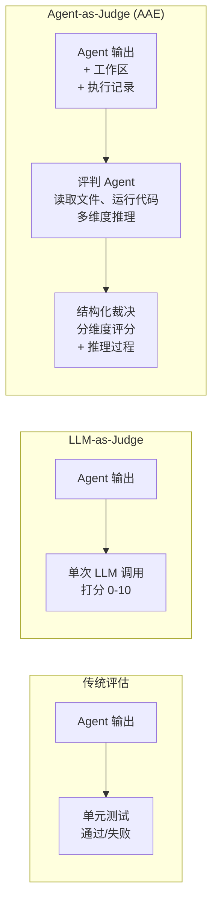
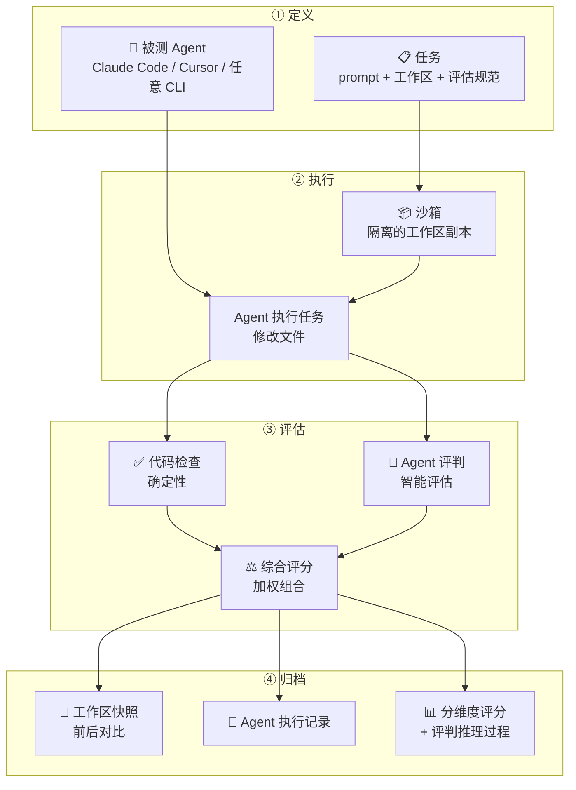
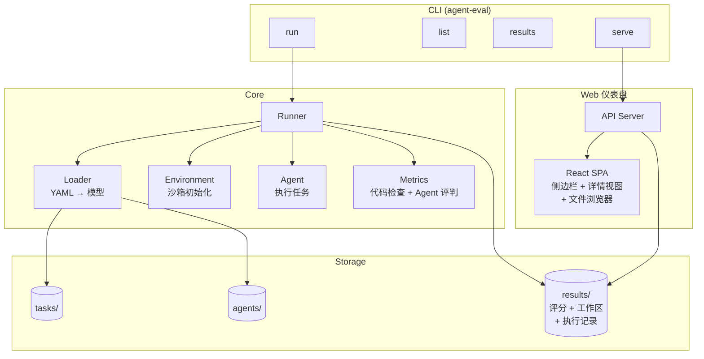

# Auto Agent Eval (AAE)

一个可插拔的 AI 编程 Agent 评估框架 —— **用 Agent 评判 Agent**。

[English](./README.md)

## 为什么要用"Agent 作为评判者"？

大多数 benchmark 只做简单的通过/失败测试。但现实中的 agent 任务——重构代码、撰写报告、分析数据——并没有唯一"正确答案"。AAE 超越了 **LLM-as-Judge**（单次 API 调用打分），进化为 **Agent-as-Judge**：一个拥有工具、文件访问和代码执行能力的评判 agent，像资深工程师 review PR 一样审查另一个 agent 的产出。



评判 agent 不只是读输出——它可以检查工作区、运行代码、对比原始文件，并从多个维度评估质量。这就像资深工程师 review PR：不只是"能编译吗"，而是"这个方案对吗"。

## 工作流程



每次运行都会完整归档工作区（前后状态）、agent 输出记录和详细的分维度评分及评判推理，便于人工复查任何结果。

## 评估理念

受 [Anthropic 评估框架](https://www.anthropic.com/engineering/demystifying-evals-for-ai-agents) 启发，AAE 围绕以下原则构建：

### 三层评分体系

| 层级 | 内容 | 适用场景 |
|------|------|----------|
| **代码检查** | pytest、文件存在性、脚本输出、退出码 | 有明确通过/失败标准的可验证结果 |
| **Agent 评判** | 读取文件、运行代码并推理的 agent | 主观质量、设计决策、完整性 |
| **人工审查** | 在 Web UI 中浏览工作区和执行记录 | 校准、边界情况、最终确认 |

### 结果 vs 过程

AAE 同时评估 agent **产出了什么**（结果）和**如何得到的**（过程）：

- **结果**：代码是否通过测试？报告中的数字是否正确？
- **过程**：agent 做了什么？花了多长时间？用了哪些工具？

两者都会被归档，因为高分并不能说明全部问题——你需要读执行记录。

### 能力评估 vs 回归测试

- **能力评估**：从低通过率开始——是 agent 还不擅长的任务，给你一个努力方向
- **回归测试**：应维持在接近 100%——防止修改 prompt 或模型时出现退步

随着能力评估通过率提升，这些任务会晋级为回归测试套件。

## 功能特性

- **Agent-as-Judge** — 评判 agent 可读取文件、运行代码、推理验证
- **代码检查** — pytest、文件存在性、脚本输出、自定义 Python 脚本
- **综合评分** — 代码检查 + Agent 评判的加权组合
- **完整归档** — 工作区（前后）、agent 执行记录、评判推理过程
- **Web 仪表盘** — 侧边栏导航、深入查看指标、浏览工作区文件
- **可插拔** — 通过 YAML 添加任务和 agent，无需修改代码
- **成本追踪** — 自动解析 agent 输出中的 credit 用量并换算为美元

## 快速开始

```bash
uv sync

# 列出可用任务和 agent
uv run agent-eval list

# 用 kiro 跑所有任务
uv run agent-eval run --agent kiro

# 跑指定任务
uv run agent-eval run django-11099 --agent kiro

# 对比多个 agent
uv run agent-eval run -a kiro -a copilot

# 按分类过滤
uv run agent-eval run --agent kiro --category bugfix

# 在终端查看结果
uv run agent-eval results

# 启动 Web 仪表盘
cd web && npm install && npm run build && cd ..
uv run agent-eval serve --port 9090
```

## 架构



## 结果目录结构

每次运行都完整归档，便于人工复查：

```
results/20260318_070812_kiro/
├── summary.json                        # 总体评分、按 agent、按分类
├── csv-stats.json                      # 单任务指标详情 + 评判推理
├── django-11099.json
├── workspaces/
│   └── kiro/
│       ├── csv-stats/
│       │   ├── .originals/             # agent 运行前的文件（用于 diff）
│       │   ├── stats.py               # agent 运行后的文件
│       │   └── test_data.csv
│       └── django-11099/
│           └── validators.py
└── logs/
    └── kiro/
        ├── csv-stats.log              # 完整 agent 执行记录
        └── django-11099.log
```

## 添加任务

```
tasks/my-task/
├── task.yaml           # prompt + 元数据
├── eval.yaml           # 评估规范
└── workspace/          # 给 agent 的初始文件
```

**task.yaml：**
```yaml
name: my-task
prompt: |
  修复 main.py 中的 bug，运行 `python test.py` 验证。
metadata:
  category: bugfix
  difficulty: easy
```

**eval.yaml** — 组合代码检查和 Agent 评判：
```yaml
evaluator:
  type: composite
  evaluators:
    - type: code
      weight: 0.6
      checks:
        - name: "测试通过"
          type: command
          cmd: "python test.py"
          expect_exit: 0
    - type: llm_judge
      weight: 0.4
      rubric:
        quality: "修复是否简洁、最小化？"
        correctness: "是否解决了根本原因，而不只是症状？"
```

## 添加 Agent

在 `agents/` 目录下创建 YAML 文件。`cli` 类型适用于任何以 prompt 作为最后一个参数的 agent：

```yaml
# agents/my-agent.yaml
name: My Agent
type: cli
config:
  command:
    - my-agent-cli
    - --some-flag        # flag 放在 prompt 之前
  timeout: 600           # 秒；长任务可适当调大（如 full-stack 任务用 1800）
  credit_price: 0.01     # 可选：每个 credit 的美元单价，启用成本追踪
```

runner 会将任务 prompt 作为最后一个参数追加：`my-agent-cli --some-flag "<prompt>"`。

### 支持的 Agent 类型

| 类型 | 适用场景 |
|------|----------|
| `cli` | 任何以 prompt 作为最后参数的 CLI 工具 |
| `claude-code` | 带环境隔离的 Claude Code |
| `mock` | 空操作，用于测试框架本身 |
| `script` | Python 脚本充当 agent |

### 真实示例

**Kiro CLI：**
```yaml
name: Kiro
type: cli
config:
  command:
    - kiro-cli-chat
    - chat
    - --no-interactive
    - --trust-all-tools
    - --model
    - claude-sonnet-4.6
  timeout: 1800
  credit_price: 0.04
```

**GitHub Copilot CLI：**
```yaml
name: GitHub Copilot CLI
type: cli
config:
  command:
    - copilot
    - --yolo
    - --model
    - claude-haiku-4.5
    - -p
  timeout: 600
  credit_price: 0.01
```

### 成本追踪

设置 `credit_price` 后，runner 会自动解析 agent 输出中的 credit 用量并换算为美元。支持的格式：

- Kiro：`▸ Credits: 0.33`
- Copilot：`AI Credits 5.04`

成本会在每个任务和汇总中显示：

```
Agent kiro        avg: 99%  💰 $0.36
Agent copilot     avg: 86%  💰 $0.48
```

## 内置任务

| 任务 | 分类 | 难度 | 描述 |
|------|------|------|------|
| csv-stats | data | easy | 修复一个在非数字数据上崩溃的 CSV 统计脚本 |
| django-11099 | bugfix | easy | 修复 URLValidator 以支持 IPv6 URL（来自 SWE-bench） |
| wordfreq | coding | easy | 从零实现一个词频统计 CLI 工具 |
| refactor | refactoring | medium | 重构杂乱代码，同时保持行为不变 |
| sales-report | analysis | medium | 分析 CSV 数据并撰写 Markdown 报告 |
| debug | bugfix | easy | 修复 Python 购物车模块中的 4 个逻辑 bug |
| git-conflict | bugfix | easy | 解决 merge conflict，采用 feature 分支策略 |
| write-tests | testing | medium | 为一个包含 6 个函数的文本工具模块编写 ≥15 个单元测试 |
| sql-bug | bugfix | medium | 修复 5 条 SQL 查询（错误聚合、GROUP BY、JOIN 类型等） |
| order-service | full-stack | hard | 根据需求文档实现一个完整的 Spring Boot 3 订单管理服务，包含 REST API、业务逻辑、集成测试和 Dockerfile |

## 技术栈

- **后端**：Python 3.14、PyYAML、stdlib HTTP server
- **前端**：Vite + React + TypeScript
- **包管理器**：uv

## 基于

本项目 fork 自 [vokako/auto-agent-eval](https://github.com/vokako/auto-agent-eval)，在原基础上扩展了：

- **5 个新任务**，覆盖 bugfix、testing、full-stack 分类——包括 `order-service`，一个需要从需求文档生成完整 Spring Boot 服务并验证编译、测试通过、Docker 运行的硬核任务
- **成本追踪**——agent 可在 YAML 中声明 `credit_price`；runner 自动解析 CLI 输出中的 credit 用量（支持 Kiro 和 GitHub Copilot 格式）并汇报每个任务及总计的美元成本
- **`exec` 沙箱修复**——`eval.yaml` 脚本中的 Python comprehension 和 generator expression 现在可以正确运行（使用单一 dict 作为 globals/locals，避免 Python 3 作用域问题）
- **Kiro CLI 和 GitHub Copilot CLI** agent 配置作为开箱即用的示例

## 参考资料

- [Demystifying Evals for AI Agents](https://www.anthropic.com/engineering/demystifying-evals-for-ai-agents) — Anthropic 的 agent 评估指南
- [Building Effective Agents](https://www.anthropic.com/engineering/building-effective-agents) — Anthropic 的 agent 设计模式
- [SWE-bench](https://www.swebench.com/) — 编程 agent benchmark
- [τ-bench](https://github.com/sierra-research/tau2-bench) — 对话 agent benchmark

## 许可证

MIT
